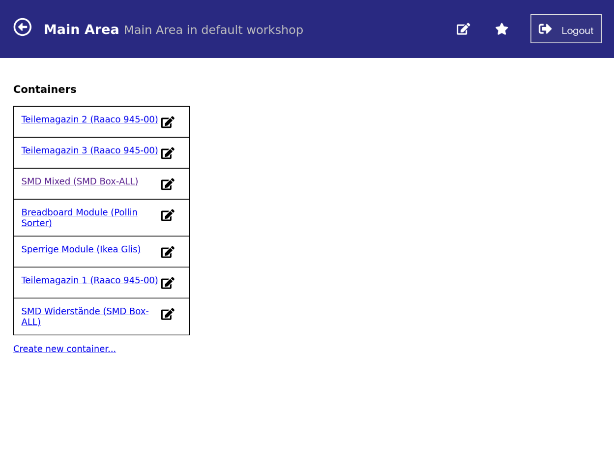
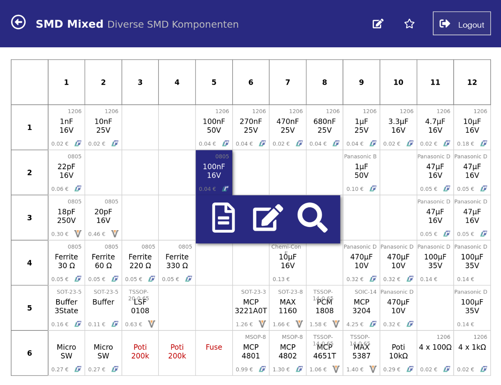
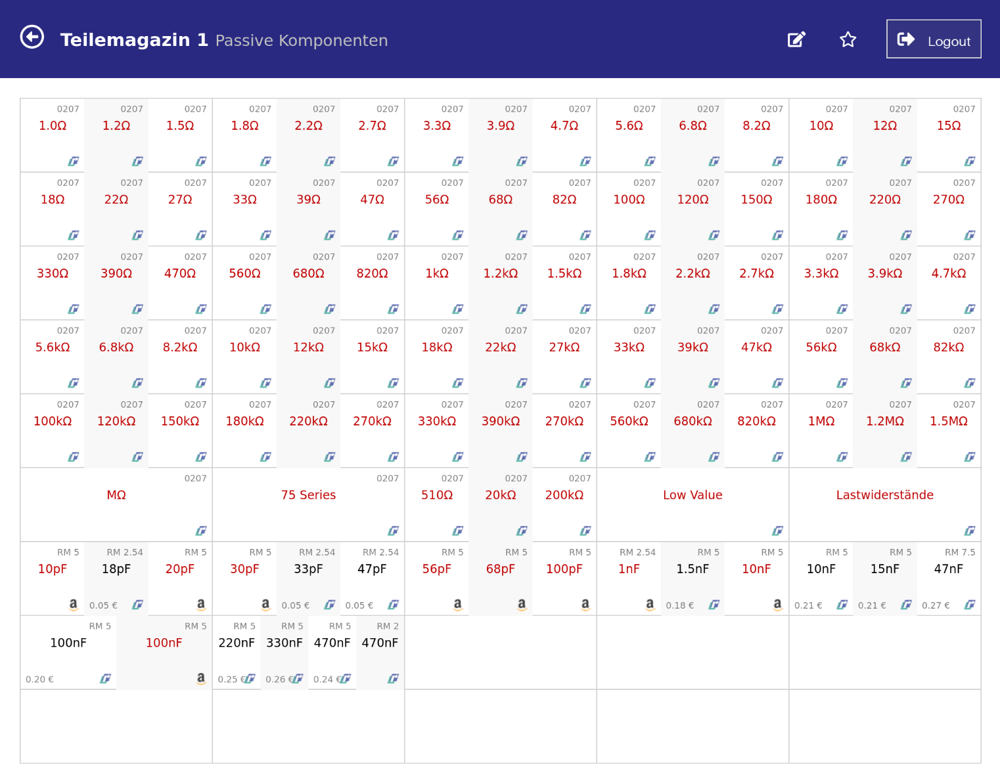
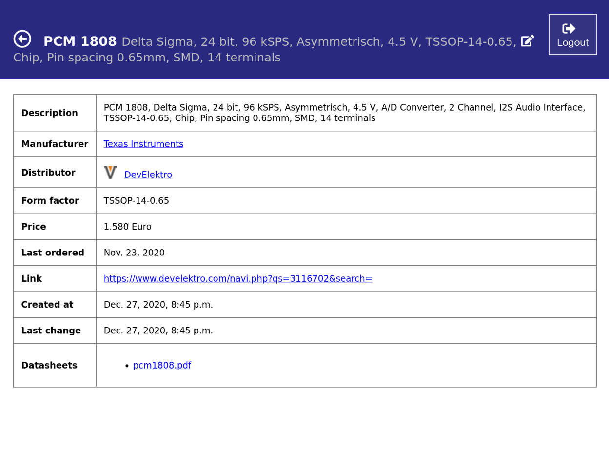
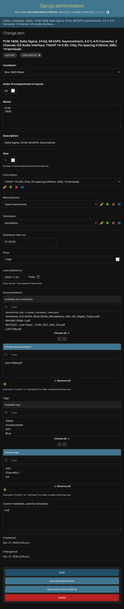

## Small parts inventory management

This project is a small parts inventory management system. It is thought out to
be a flexible parts database which keeps all relevant information as well as
datasheets, prices and a visual representation where you stored the part.

The idea is that the system may tell you in which compartment of which box in
what area of your workshop you have to search for to find the part you
currently need. It has been optimized to store information for electronics
parts and small other hardware like screws, nuts and bolts.

### Prerequisites

As configured by default you will need the following:

- A postgres database named `inventory` with a postgres user `inventory` that
  may connect without password or by default with the password `inventory`
- Python > 3.10
- Poetry to install requirements and create a virtualenv

### Installation

This is a standard Django 5.0 application, if you know how to deploy those the
following might sound familiar:

1. Checkout repository: `git clone https://github.com/dunkelstern/inventory.git`
2. Change to checkout: `cd inventory`
3. Install virtualenv and dependencies: `poetry install`
4. Migrate the Database: `poetry run python manage.py migrate`
5. Create an admin user: `poetry run python manage.py createsuperuser`
6. Run the server
  - Development server (not for deployment!): `poetry run python manage.py runserver`
  - Deployment via `gunicorn` on port 8000: `poetry run gunicorn inventory_project.wsgi -b 0.0.0.0:8000`

Then login on `http://localhost:8000/admin/` for the Django admin interface or
go to `http://localhost:8000` to enter the inventory management system directly

### Additional information

1. The initial DB migration pre-populates the database with some useful defaults
  and some pre-defined distributors and form-factors usable for electronics
  inventories as well as a "Default Workshop" to be able to navigate everything.
2. For editing parts the Django admin interface is used, so edit-links will only
  appear if the currently logged in user is a `staff` user (set the checkbox
  in the admin area).

### Screenshots

#### Overview Page

here we have a layer of containers, you may nest multiple containers into each
other, for example to define a cupboard which contains multiple boxes of parts,
or multiple rooms in your workshop that contain cupboards, etc.

#### Box View

This is a container that contains parts. You may define your layouts (number of
compartments, number of items per compartment and layout of compartments
themselves) all by yourself in the admin backend, by default the database comes
with an assortment of Ikea and Raaco sorter boxes.

The Overview and Box views are designed to be used on a touch-screen and the HTML,
CSS and Javascript are designed to work on older Hardware (Apple iOS 9 has been
tested at lowest, so this works from iPad 2 up to the newest pro).

#### Part detail view

This is the detail view of a part, this is useful to find all parts by manufacturer
or distributor, or when a part has multiple datasheets.

#### Part edit view

Editing is done on the standard Django admin interface, so all users that have no
*staff* privileges only can view all parts, all with *staff* privileges have access
to the django admin backend and can edit parts too.

